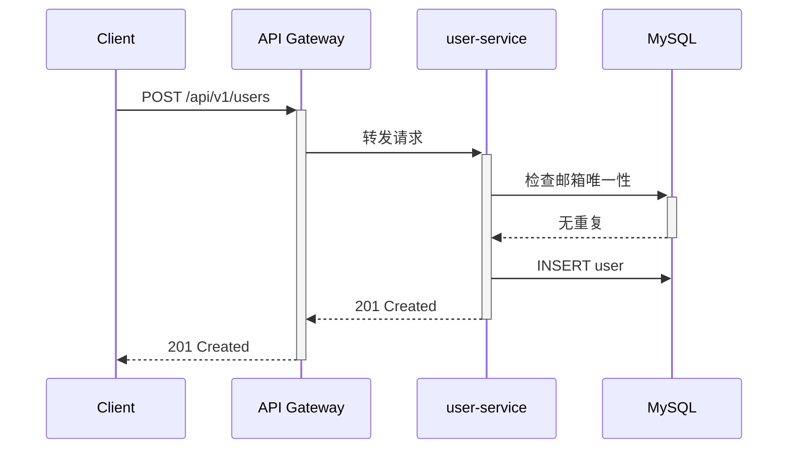

# [功能名称] 技术设计文档

**状态**: Draft / Review / Approved
**作者**: @xxx
**评审人**: @yyy, @zzz
**日期**: YYYY-MM-DD
**关联 PRD**: [链接]

---

## 1. 背景与目标

### 1.1 背景
（为什么要做这个功能，解决什么问题）

### 1.2 目标
- [ ] 功能目标 1
- [ ] 功能目标 2

### 1.3 非目标（明确不做的事）
- 本期不支持 xxx

---

## 2. 方案设计

### 2.1 系统上下文

```
（C4 Model 图 或 时序图）

Client ──► API Gateway ──► user-service ──► MySQL
                                     └──► Redis
```

### 2.2 核心流程

（关键业务流程的时序图）



### 2.3 数据模型

```sql
CREATE TABLE users (
    id         BIGINT       NOT NULL AUTO_INCREMENT,
    username   VARCHAR(32)  NOT NULL,
    email      VARCHAR(128) NOT NULL,
    ...
    PRIMARY KEY (id),
    UNIQUE KEY uk_email (email)
);
```

### 2.4 接口设计

（引用 OpenAPI 文档，或在此列出核心接口）

### 2.5 异常处理

| 场景 | 处理方式 |
|------|---------|
| 邮箱已存在 | 返回 409 Conflict |
| 数据库不可用 | 返回 500，触发告警 |

---

## 3. 备选方案

### 方案 A（选定）
...优缺点...

### 方案 B（放弃）
放弃原因：...

---

## 4. 非功能性考量

### 4.1 性能
- 预估 QPS：xxx
- P99 目标：< 100ms
- 索引策略：...

### 4.2 安全
- 鉴权方式：JWT Bearer
- 敏感字段：密码字段不在响应中返回

### 4.3 可观测性
- 关键指标：用户创建成功率、P99 延迟
- 日志：用户创建/删除记录 user_id

---

## 5. 实施计划

| 阶段 | 工作 | 工时估算 |
|------|------|---------|
| 第一周 | 数据库设计、API 设计评审 | 2d |
| 第二周 | 核心功能开发 | 3d |
| 第三周 | 测试、文档 | 2d |

---

## 6. 评审意见

| 评审人 | 意见 | 状态 |
|-------|------|------|
| @yyy | LGTM | ✅ |
| @zzz | 建议添加限流 | 待处理 |
